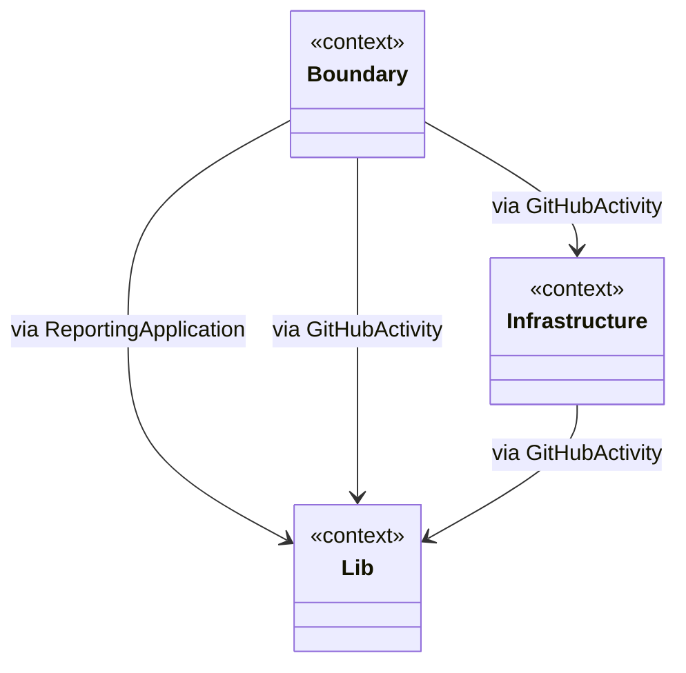
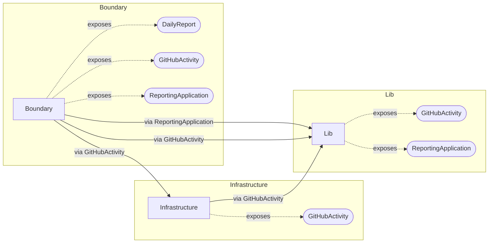
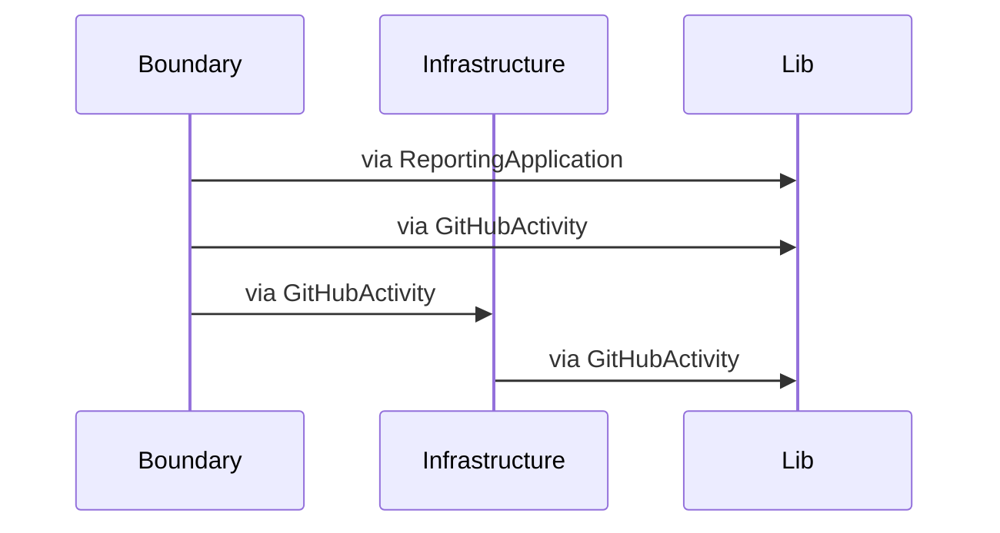

# Architecture: GitHubActivity

The GitHub activity report is an executable architecture. Its names describe the
business and technical responsibilities directly: a replaceable CLI boundary,
an external-system infrastructure adapter, and a lib layer containing the
activity and reporting bounded contexts.

Implementation: `go` at `.`

## Context relationships



## Component view



## Interaction view (declared relationships)



## Contracts and modules

```mermaid
classDiagram
  class context_Boundary["Boundary"]
  <<context>> context_Boundary
  class interface_Boundary_DailyReport["DailyReport"]
  <<interface>> interface_Boundary_DailyReport
  context_Boundary o-- interface_Boundary_DailyReport : owns
  interface_Boundary_DailyReport : +render(snapshot ReportingSnapshot) returns string
  class interface_Boundary_GitHubActivity["GitHubActivity"]
  <<interface>> interface_Boundary_GitHubActivity
  context_Boundary o-- interface_Boundary_GitHubActivity : owns
  interface_Boundary_GitHubActivity : +activities(organization Organization, window TimeWindow) returns ActivityFeed
  interface_Boundary_GitHubActivity : +organizations() returns Organization[]
  class interface_Boundary_ReportingApplication["ReportingApplication"]
  <<interface>> interface_Boundary_ReportingApplication
  context_Boundary o-- interface_Boundary_ReportingApplication : owns
  interface_Boundary_ReportingApplication : +generate(window string) returns string
  class module_Boundary["Boundary"]
  <<module>> module_Boundary
  context_Boundary o-- module_Boundary : owns
  class module_Boundary_CLI["Boundary.CLI"]
  <<module>> module_Boundary_CLI
  context_Boundary o-- module_Boundary_CLI : owns
  class context_Infrastructure["Infrastructure"]
  <<context>> context_Infrastructure
  class interface_Infrastructure_GitHubActivity["GitHubActivity"]
  <<interface>> interface_Infrastructure_GitHubActivity
  context_Infrastructure o-- interface_Infrastructure_GitHubActivity : owns
  interface_Infrastructure_GitHubActivity : +activities(organization Organization, window TimeWindow) returns ActivityFeed
  interface_Infrastructure_GitHubActivity : +organizations() returns Organization[]
  class module_Infrastructure["Infrastructure"]
  <<module>> module_Infrastructure
  context_Infrastructure o-- module_Infrastructure : owns
  class module_Infrastructure_GitHub["Infrastructure.GitHub"]
  <<module>> module_Infrastructure_GitHub
  context_Infrastructure o-- module_Infrastructure_GitHub : owns
  class context_Lib["Lib"]
  <<context>> context_Lib
  class interface_Lib_GitHubActivity["GitHubActivity"]
  <<interface>> interface_Lib_GitHubActivity
  context_Lib o-- interface_Lib_GitHubActivity : owns
  interface_Lib_GitHubActivity : +activities(organization Organization, window TimeWindow) returns ActivityFeed
  interface_Lib_GitHubActivity : +organizations() returns Organization[]
  class interface_Lib_ReportingApplication["ReportingApplication"]
  <<interface>> interface_Lib_ReportingApplication
  context_Lib o-- interface_Lib_ReportingApplication : owns
  interface_Lib_ReportingApplication : +generate(window string) returns string
  class module_Lib["Lib"]
  <<module>> module_Lib
  context_Lib o-- module_Lib : owns
  class module_Lib_Activity["Lib.Activity"]
  <<module>> module_Lib_Activity
  context_Lib o-- module_Lib_Activity : owns
  class module_Lib_Reporting["Lib.Reporting"]
  <<module>> module_Lib_Reporting
  context_Lib o-- module_Lib_Reporting : owns
  module_Boundary_CLI ..|> interface_Boundary_DailyReport : implements
  module_Infrastructure_GitHub ..|> interface_Infrastructure_GitHubActivity : implements
  module_Lib_Activity ..|> interface_Lib_GitHubActivity : implements
  module_Lib_Reporting ..|> interface_Lib_ReportingApplication : implements
  module_Lib_Reporting ..> interface_Lib_GitHubActivity : uses
```



## Source ownership

```mermaid
flowchart TB
  subgraph source_module_[""]
    direction TB
    file_main_go["main.go (entrypoint main)"]
  end
  subgraph source_module_Boundary["Boundary"]
    direction TB
  end
  subgraph source_module_Boundary_CLI["Boundary.CLI"]
    direction TB
    file_boundary_cli_cli_go["cli.go"]
    file_boundary_cli_fatal_go["fatal.go"]
    file_boundary_cli_logger_go["logger.go"]
    file_boundary_cli_markdown_go["markdown.go"]
    file_boundary_cli_options_go["options.go"]
  end
  subgraph source_module_Infrastructure["Infrastructure"]
    direction TB
  end
  subgraph source_module_Infrastructure_GitHub["Infrastructure.GitHub"]
    direction TB
    file_infrastructure_github_activities_go["activities.go"]
    file_infrastructure_github_auth_go["auth.go"]
    file_infrastructure_github_client_go["client.go"]
    file_infrastructure_github_client_factory_go["client_factory.go"]
    file_infrastructure_github_commit_activities_go["commit_activities.go"]
    file_infrastructure_github_constants_go["constants.go"]
    file_infrastructure_github_event_activities_go["event_activities.go"]
    file_infrastructure_github_first_line_go["first_line.go"]
    file_infrastructure_github_get_go["get.go"]
    file_infrastructure_github_http_client_go["http_client.go"]
    file_infrastructure_github_issue_activities_go["issue_activities.go"]
    file_infrastructure_github_organizations_go["organizations.go"]
    file_infrastructure_github_summarize_go["summarize.go"]
  end
  subgraph source_module_Lib["Lib"]
    direction TB
  end
  subgraph source_module_Lib_Activity["Lib.Activity"]
    direction TB
    file_lib_activity_activity_go["activity.go"]
    file_lib_activity_activity_feed_go["activity_feed.go"]
    file_lib_activity_activity_source_go["activity_source.go"]
    file_lib_activity_commit_result_go["commit_result.go"]
    file_lib_activity_event_go["event.go"]
    file_lib_activity_issue_result_go["issue_result.go"]
    file_lib_activity_organization_go["organization.go"]
    file_lib_activity_search_response_go["search_response.go"]
    file_lib_activity_time_window_go["time_window.go"]
  end
  subgraph source_module_Lib_Reporting["Lib.Reporting"]
    direction TB
    file_lib_reporting_human_actor_go["human_actor.go"]
    file_lib_reporting_report_result_go["report_result.go"]
    file_lib_reporting_report_statistics_go["report_statistics.go"]
    file_lib_reporting_reporting_snapshot_go["reporting_snapshot.go"]
    file_lib_reporting_service_go["service.go"]
    file_lib_reporting_statistics_go["statistics.go"]
  end
```
